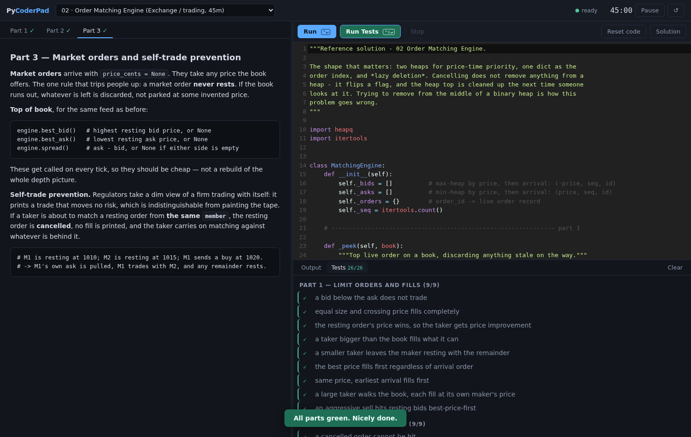

# Wololoop

> `while not hired: practice()`

A CoderPad-style practice pad that runs **real Python 3** and **strict
TypeScript** in your browser, plus **14 staged interview problems** built to
feel like the real thing: a simple problem first, then an interviewer piling on
requirements once your first solution works.

No server, no build step, no dependencies. It's a folder of static files —
dressed, for no defensible reason, as an Age of Empires interface.



## Run it

**Locally** — any static file server will do:

```bash
python3 -m http.server 8000
# open http://localhost:8000
```

(You can't open `index.html` directly off disk: the page fetches the challenge
files, and browsers block `fetch` on `file://`.)

**Your own copy on the web** — fork this repo, then:

1. **Settings → Pages**
2. **Source: Deploy from a branch**
3. Branch **`main`**, folder **`/ (root)`** → Save

A minute later it's live at `https://<you>.github.io/wololoop/`. Nothing else
to configure — your code, your timer and your progress never leave your browser.

## How a session works

You get **Part 1 only**. Parts 2 and 3 are locked until your tests go green.

That's deliberate. The most common way strong candidates lose a senior loop is
by building for requirements they haven't been given — an abstract factory for a
problem that turns out to need a dict. Here you can't see the twist, so you have
to make the same judgement call you'd make in the room.

- **Run** (`Ctrl+Enter`) executes your file, prints go to Output.
- **Run Tests** (`Ctrl+Shift+Enter`) checks every part you've unlocked — so
  Part 2 has to keep Part 1 passing, same as real life.
- The clock starts on your first run and counts down the problem's budget.
- Stuck? There's an "open it anyway" button on the locked part, and a
  **Solution** button. Both are recorded in your session so you know which
  problems you actually solved.
- **Stop** kills a runaway loop. It restarts the Python runtime, so the session's
  state is gone — that's the cost of not having a server to kill.

## The problems

### Python

Each is 30–45 minutes, three parts, all stdlib. Between them they cover heaps,
union-find, graphs, interval sweeps, sliding windows, greedy assignment,
integer-money discipline and event replay — no two have the same shape of
answer.

| # | Problem | Domain | The arc |
|---|---------|--------|---------|
| 01 | Trade Settlement Netting | Capital markets | Net positions → multilateral cash netting → FX and settlement dates |
| 02 | Order Matching Engine | Exchange / trading | Limit order book → cancels and depth → market orders and self-trade prevention |
| 03 | Payments Rate Limiter | Fintech infrastructure | Fixed window → sliding window → token bucket per tier |
| 04 | CRM Lead Deduplication | CRM / entity resolution | Normalise and group → transitive clusters → golden records |
| 05 | Consulting Utilisation | Professional services | Weekly utilisation → double bookings → staffing the bench |
| 06 | SaaS Billing and Proration | SaaS / billing | Whole-period invoice → mid-cycle proration → replaying the event log |
| 07 | Clickstream Sessionisation | Product analytics | Sessions → funnel conversion → top pages by reach |
| 08 | Inventory Allocation | Retail supply chain | FEFO allocation → multi-warehouse → reservations with TTL |
| 09 | Incident Alert Correlation | SRE / observability | Error rates → burst detection with hysteresis → alerts into incidents |
| 10 | Health Claims Adjudication | Health insurance | Deductible and coinsurance → out-of-pocket maximums → late claims and reversals |

### TypeScript: API design, built on Granola's public API

Four problems about designing and consuming APIs, using the endpoints,
shapes, webhook signing and changelog from [Granola's public API
docs](https://docs.granola.ai/introduction). Where a problem goes past what
Granola actually does (version pinning in 14), the problem says so.

Here the **types are tested too**. Tests use `// @ts-expect-error` to check
that your API *rejects* misuse: if your types let something through that they
shouldn't, the test goes red even when every runtime value is right. Your own
file must also type-check under `strict`.

| # | Problem | The arc |
|---|---------|---------|
| 11 | Granola Notes API Client | Lazy cursor pagination as an `AsyncIterable` → retries with backoff, `retry-after` and a typed error union → overloads for `include=transcript`, the 413 fallback, bounded-concurrency bulk fetch |
| 12 | Granola Webhook Receiver | Standard Webhooks HMAC verification with replay window → a router whose handlers are narrowed per event type, with exactly-once handling under concurrent retries → a latest-wins fetch coalescer |
| 13 | Typed Endpoints for the Notes API | Validating List Notes' real query params → a Zod-sized schema library with inferred types → a router with path params inferred from the route string |
| 14 | Evolving the Notes API | Version pinning with downgrades built from the real changelog → a breaking-change detector for response schemas → request schemas, where variance flips the rules, and semver bumps |

## Adding your own

One directory per challenge under `challenges/`:

```
challenges/15-your-problem/
    meta.json     title, domain, minutes, stage names, "language" ("python" if absent)
    parts.md      the three parts, separated by a line containing <!-- part -->
    starter.py    stubs that raise NotImplementedError
    tests.py      @stage(n)-tagged tests
    solution.py   reference solution, shown only on request
```

Tests run in the **same namespace** as the candidate's code, so they call
functions by name with no imports. `@stage(n)`, `assert_eq` and `assert_close`
come from `runtime/harness.py` for free.

For a TypeScript problem, set `"language": "typescript"` and use `.ts` files.
None of the three files are modules (no `import`/`export`), so they share one
global scope just like the Python version. `runtime/harness.ts` gives you
`test(n, name, fn)` (fn may be async), `assertEqual` (deep), `assertThrows`,
`assertRejects`, `assert`, `NotImplementedError` for stubs, and `main(fn)` for
code that should run on **Run** but not under **Run Tests**. Two rules for
`tests.ts`:

- A type error inside a `test(...)` call fails only that test, which is what
  makes `// @ts-expect-error` a real assertion.
- Anything **outside** a `test(...)` call must compile against the bare
  starter, or Part 1 can never go green. If a helper needs a later part's
  types, tag it with a `/** @stage n */` doc comment and its type errors count
  against Part n only. `verify.py` checks for this.

Then:

```bash
python3 tools/gen_manifest.py    # rebuild challenges/manifest.json
python3 tools/verify.py          # every solution green, every starter red
```

`verify.py` runs the same harness the browser does, without a browser — so
green here means green in the pad. It also checks each starter **fails**,
because a stage that passes before you've written anything is a broken stage.
TypeScript challenges need Node 20+; the first run installs the pinned
compiler into `tools/.cache` (gitignored).

## How it works

- **Pyodide 0.28.3** (CPython 3.13.2 compiled to WebAssembly), pinned in one
  constant at the top of `js/pyworker.js`.
- **TypeScript 6.0.3**, the last release of the compiler written in
  TypeScript (7.x is the native Go port and can't run in a browser), loaded
  from jsDelivr into its own long-lived worker. It type-checks with `strict`
  and transpiles; `runtime/tscompile.js` is shared with the headless verifier.
  Each run gets a **fresh worker**, so every run starts with a clean global
  scope and Stop is just "terminate it". Stack traces are mapped back to your
  `.ts` line numbers.
- Python runs in a **Web Worker**, so an infinite loop can't freeze the page —
  Stop terminates the worker and a fresh one takes its place. There's no
  interrupt buffer because `SharedArrayBuffer` needs COOP/COEP response headers,
  and GitHub Pages can't set headers.
- Editor is CodeMirror 5 from a CDN, falling back to a plain textarea if it
  can't load.
- The skin is pure CSS — parchment, timber and gold bevels are all gradients,
  the resource-bar icons are inline SVG, and the only external assets are two
  Google fonts. Nothing breaks if they fail to load.
- Your code, unlocked parts and remaining time are kept in `localStorage`, per
  challenge, per browser.

**First load pulls about 11 MB** of Python runtime (or about 9 MB of TypeScript
compiler, the first time you open a TypeScript problem) from jsDelivr, so it
needs a network connection once; the browser caches it after that. Everything
else is served from the repo.

## The name

[Wololo](https://en.wikipedia.org/wiki/Age_of_Empires) is the chant an Age of
Empires monk makes while converting one of your units to their side. Add a loop
and you have a coding interview: you walk in as one thing and walk out
converted, assuming the tests go green.

## Licence

MIT — see [LICENSE](LICENSE).
